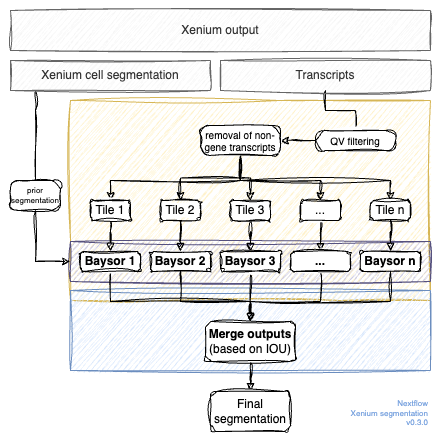

# Xenium segmentation

A nextflow pipeline for segmentation of 10x Xenium runs. The pipeline consists of the following parts:

- Create a nuclear segmentation using the DAPI maximal intensity projection using a trained cellpose model. In our experience, this works slightly better that the nuclear segmentation that Xenium is running internally. See the [nuclear_segmentation.ipynb](https://github.com/maximilian-heeg/xenium-segmentation/blob/main/scripts/nuclear_segmentation.ipynb) notebook. Cellpose and all dependencies are wrapped in a [docker image](https://github.com/maximilian-heeg/docker-cellpose).
- Assign transcripts to nucleus (or unassigned if not within a nucleus). 
- Filter the transcripts based on OV values, remove non-gene transcripts and create smaller tiles of the dataset. For more information see [tile-xenium](https://github.com/maximilian-heeg/tile-xenium).
- Run Baysor on all tiles. This step uses [Baysor](https://github.com/kharchenkolab/Baysor) wrapped in a [docker image](https://github.com/maximilian-heeg/baysor-container).
- Merge the segmentation results to get one final segmentation. This [program](https://github.com/maximilian-heeg/merge-baysor) merges cells based on an IOU threshold.

## Usage

The pipeline requires a working installation of [nextflow](https://www.nextflow.io/). Further, it uses [singularity/apptainer](https://apptainer.org/) to run the scripts in reproducible environments.
Run the pipeline with:

    nextflow run maximilian-heeg/xenium-segmentation -r v0.1.2 --xenium_path PATH_TO_XENIUM_OUTOUT

### Parameters

Many parameters can be manually set (and might need to be adjusted for best reuslts.)

    /*********************************
    Input and Output. 
    *********************************/ 
    // The folder pointing towards the xenium results
    xenium_path = null
        // Path to where the final csv should be saved.
    outdir = 'results'
    
    /*********************************
    Tile creation
    *********************************/
    // The width of a tile
    tile.width = 4000 
    // The height of a tile
    tile.height = 4000
    // The overlap between titles. The next tile with start at x + width - overlap, 
    // or y + height - overlap
    tile.overlap = 200
    // The minimum Q-Score to pass filtering. 
    tile.qv = 20
    // The minimum number of transcripts per tile. This is important
    // because baysor cannot work, if there are too few transcripts.
    // If the minimal number is not met in a tile, it will be expanded by `overlap` 
    // in all fofur directions until the criterion is met.
    tile.minimal_transcripts = 10000

    /*********************************
    Baysor
    *********************************/
    // Minimal number of molecules for a cell to be considered as
    // real. It's an important parameter, as it's used to infer
    // several other parameters. Overrides the config value.
    // If set to -1, the pipeline will calcuate the median transcripts per cell based 
    // on the 10x segmentation and use that value as min_molecules_per_cell
    baysor.min_molecules_per_cell = -1

    // If min_molecules_per_cell should be estimated, this values defines the fraction of 
    // the median transcripts per cell that will be set as min_molecules_per_cell
    baysor.min_molecules_per_cell_fraction = 0.75

    // Minimal number of molecules in a segmented region, required for this region to be 
    // considered as a possible cell.
    // 0: min_molecules_per_cell / 4 (Baysor default)
    // string ended with '%' to set it relative to min_molecules_per_cell
    baysor.min_molecules_per_segment = '50%'

    // Standard deviation of scale across cells. Can be either
    // number, which means absolute value of the std, or string
    // ended with '%' to set it relative to scale (default: "25%")
    // Negative values mean it must be estimated from `min_molecules_per_cell`
    baysor.scale = -1.0

    // Standard deviation of scale across cells. Can be either number, which
    // means absolute value of the std, or string ended with "%" to set it 
    // relative to scale. Default: "25%"
    baysor.scale_std = "25%"

    // Number of clusters to use for cell type segmentation. Default: 4
    baysor.n_clusters = 4

    // Confidence of the prior_segmentation results.
    // Value in [0; 1]. If you want the final segmentation not
    // contradicting to prior_segmentation, set it to 1.
    // Otherwise, if you assume errors in prior_segmentation,
    // values in [0.2-0.7] allow flexibility for the algorithm.
    baysor.prior_segmentation_confidence = 0.5

    // Comma-separated list of nuclei-specific genes. If provided, 
    // `cyto-genes` has to be set, as well.
    nuclei_genes = ""
    
    // Comma-separated list of cytoplasm-specific genes. If provided,
    // `nuclei-genes` has to be set, as well.
    cyto_genes = ""

    // Comma-separated list of genes or regular expressions to ignore
    // during segmentation. Example: 'Blank*,MALAT1'
    baysor.exclude_genes = ""

    // new-component-weight is proportional to the probability of 
    // generating a new cell for a molecule, instead of assigning 
    // it to one of the existing cells. More precisely, the probability 
    // to assign a molecule to a particular cell linearly depends on 
    // the number of molecules, already assigned to this cell. And this
    // parameter is used as the number of molecules for a cell, which is
    // just generated for this new molecule. The algorithm is robust to
    // small changes in this parameter. And normally values in the range
    // of 0.1-0.9 should work fine. Smaller values would lead to slower
    // convergence of the algorithm, while larger values force the 
    // emergence of a large number of small cells on each iteration, 
    // which can produce noise in the result. In general, the default 
    // value should work well.
    baysor.new_component_weight = 0.2

    /*********************************
    Merging
    *********************************/
    // Threshold for stitching. If the IOU for two cells is greater than 
    // the threshold, they will be merged
    merge.iou_threshold = 0.2

    /*********************************
    Report
    *********************************/
    // Width in px of the boundary plot
    report.width = 1800
    // Height in px of the boundary plot
    report.height = 1600
    // X offset in px of the FOV that is beeing used for 
    // the plot (-1: center FOV)
    report.x_offset = -1
    // y offset in px of the FOV that is beeing used for 
    // the plot (-1: center FOV)
    report.y_offset = -1

These parameters can either be changed by adding the parameters to the command (`--baysor.min_molecules_per_cell 60`) or by creating a `nextflow.config` file within the working directory.

<pre>
// Change the min_molecules_per_cell for Baysor
params {
    baysor.min_molecules_per_cell = <strong>60</strong>
}
</pre>

### Executors

> In the Nextflow framework architecture, the executor is the component that determines the system where a pipeline process is run and supervises its execution.
> 
> The executor provides an abstraction between the pipeline processes and the underlying execution system. This allows you to write the pipeline functional logic independently from the actual processing platform.
> 
> In other words, you can write your pipeline script once and have it running on your computer, a cluster resource manager, or the cloud — simply change the executor definition in the Nextflow configuration file.

Again, you can set an executor by modifying the `nextflow.config`.

<pre>
// Use the PBS scheduler
process {
    executor = 'pbs'
    queue = 'home-yeo'
}
</pre>
